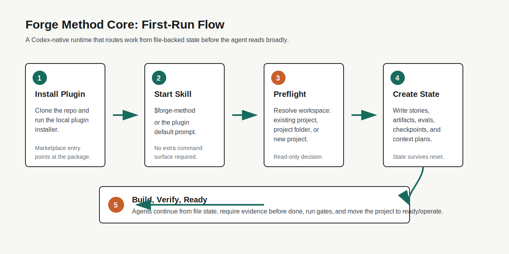

# Marketplace And Onboarding

Forge Method Core is packaged for plugin-first distribution. This document keeps listing copy, first-run UX, and publication boundaries in one place.

## Listing Metadata

The marketplace-ready listing source is:

```txt
assets/marketplace/listing.json
```

It contains:

- display name, tagline, category, developer, and summary
- GitHub marketplace install command
- local fallback install commands for Windows and POSIX shells
- first-run prompts
- capability labels
- privacy and state notes
- validation commands
- release notes feed
- onboarding asset references

The listing metadata is prepared for reuse in a plugin directory or publication process, but public directory submission remains external to this repository.

## First-Run Flow



The first-run UX should stay this small:

1. Install the plugin.
2. Open a project workspace.
3. Start `$forge-method` or use the plugin default prompt.
4. Let preflight present existing projects or creation options.
5. Create or resume durable file-backed state.
6. Continue through build, verification, and ready/operate.

After 1.25 is installed from the Git marketplace, later `$forge-method` starts check for package updates, show compact patch notes when a new version is installed, and continue in the same chat.

## Onboarding Copy

Use this short description wherever a user needs to decide whether to install:

```txt
Forge Method Core runs state-machine creation workflows inside Codex. It keeps project progress in files, routes startup through read-only preflight decisions, and validates work with stories, evidence, evals, checkpoints, and quality gates.
```

Use this one-line first action:

```txt
Start Forge Method in this workspace.
```

Use this recovery action:

```txt
Resume this Forge Method project from file state.
```

## Publication Boundary

Current repository scope:

- validated plugin package
- GitHub marketplace source at `.agents/plugins/marketplace.json`
- local marketplace installer
- workspace share deeplink
- first-run visual asset
- marketplace listing metadata
- release notes feed
- clone/install smoke from a published Git ref

External publication scope:

- public directory submission
- public listing approval
- public ranking/category placement
- hosted screenshots or promotional media not stored in this repo
